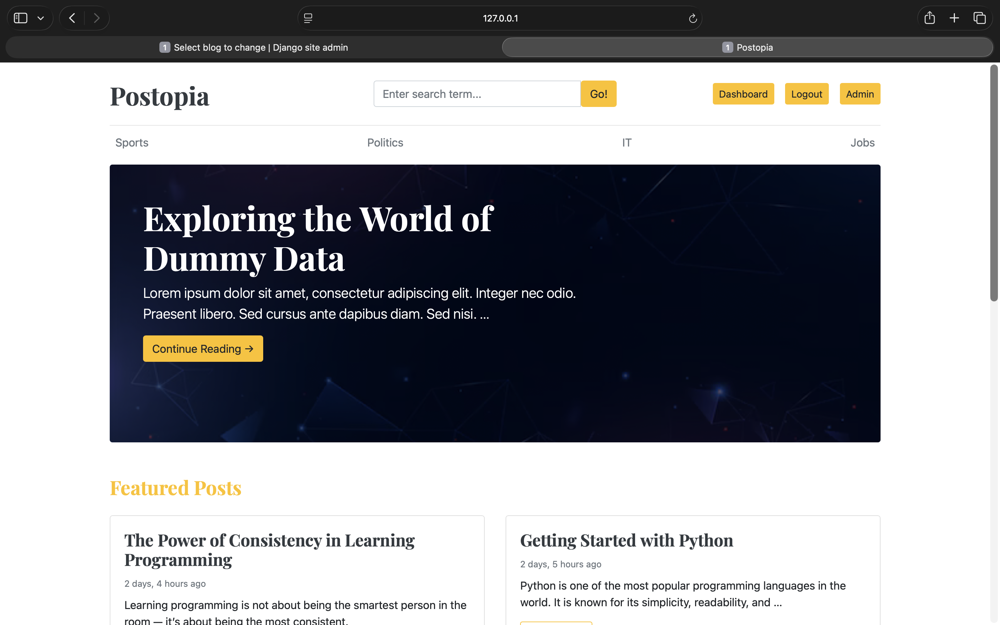
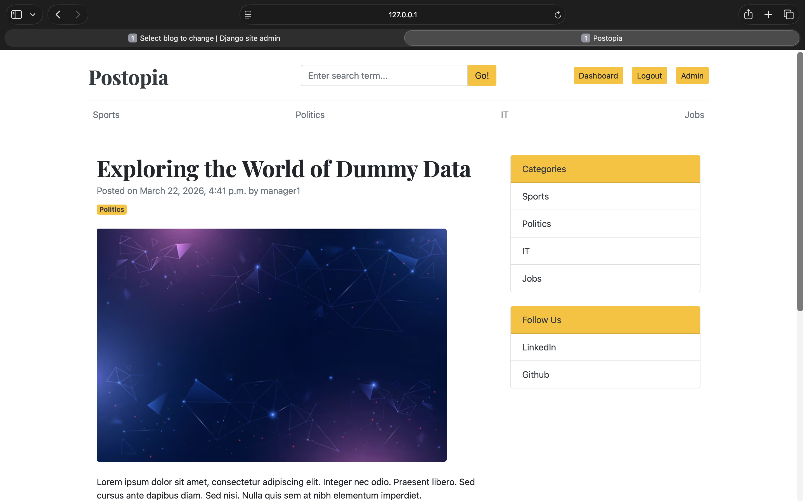

<div align="center">

# 📝 Django Blog

**A full-featured blogging platform with a public blog, rich content management, and a protected admin dashboard.**

<br/>

[](https://python.org)
[](https://djangoproject.com)
[](https://getbootstrap.com)
[](https://sqlite.org)
[](LICENSE)

<br/>

[✨ Features](#-features) · [🖼️ Screenshots](#️-screenshots) · [⚙️ Setup](#️-installation--setup) · [🔑 URLs](#-url-reference) · [🗄️ Models](#️-data-models)

</div>

---

## ✨ Features

- 🏠 **Homepage** — Hero banner for featured posts + recent articles grid
- 📖 **Blog Detail** — Full post view with a live comment section
- 🔍 **Search** — Full-text search across title, description, and body
- 🗂️ **Categories** — Filter posts by category
- 🔐 **Authentication** — Register, login, and logout
- 🛠️ **Admin Dashboard** — Protected content management area
  - 📄 Full CRUD for blog posts (image upload + auto slug)
  - 🏷️ Full CRUD for categories
  - 👥 Full CRUD for users with roles & permissions
- ⚙️ **Django Admin Panel** — Search, filters, and inline editing
- 📣 **About & Social Links** — Singleton-style site info via Django Admin

---

## 🖼️ Screenshots

> 📸 *Add your screenshots to a `/screenshots` folder and update the paths below.*

<br/>

### 🏠 Homepage


### 📖 Blog Detail


### 🛠️ Admin Dashboard


### 📄 Post Management


---

## 🛠️ Tech Stack

<div align="center">

| Layer | Technology | Version |
|:------|:-----------|:--------|
|  **Language** | Python | 3.13 |
|  **Framework** | Django | 6.0.3 |
|  **Frontend** | Bootstrap | 4 |
|  **Database** | SQLite | default |
| 📋 **Forms** | django-crispy-forms + crispy-bootstrap4 | 2.6 / 2026.2 |
| 🖼️ **Images** | Pillow | 12.1.1 |

</div>

---

## 📁 Project Structure

```
django_blog/
│
├── 📁 blog_main/                  # Core project — settings & root URLs
│   ├── settings.py
│   ├── urls.py
│   └── views.py                   # Home, login, logout, register
│
├── 📁 blogs/                      # Public-facing blog app
│   ├── models.py                  # Blog, Category, Comment, About, Sociallinks
│   ├── views.py                   # posts_by_category, blog detail, search
│   ├── admin.py
│   └── urls.py
│
├── 📁 dashboards/                 # Protected dashboard app
│   ├── views.py                   # CRUD for posts, categories, users
│   ├── forms.py                   # Categoryform, Postform, UserForm
│   └── urls.py
│
├── 📁 templates/                  # HTML templates (Bootstrap 4)
├── 📁 media/                      # Uploaded images (auto-created)
├── manage.py
└── requirements.txt
```

---

## ⚙️ Installation & Setup

### 1. 📥 Clone the Repository

```bash
git clone https://github.com/your-username/django_blog.git
cd django_blog
```

### 2. 🐍 Create & Activate a Virtual Environment

```bash
python -m venv env

# macOS / Linux
source env/bin/activate

# Windows
env\Scripts\activate
```

### 3. 📦 Install Dependencies

```bash
pip install -r requirements.txt
```

### 4. 🗄️ Apply Migrations

```bash
python manage.py migrate
```

### 5. 👤 Create a Superuser

```bash
python manage.py createsuperuser
```

### 6. 🚀 Run the Development Server

```bash
python manage.py runserver
```

🌐 Open your browser and visit: **`http://127.0.0.1:8000`**

---

## 🔑 URL Reference

| URL | 📄 Description |
|:----|:--------------|
| `/` | Homepage — featured & recent posts |
| `/blogs/<slug>/` | Single post detail + comments |
| `/category/<id>/` | Posts filtered by category |
| `/search/?keyword=` | Search across title, description & body |
| `/register/` | User registration |
| `/login/` | User login |
| `/logout/` | User logout |
| `/dashboard/` | 🔐 Admin dashboard (login required) |
| `/dashboard/posts/` | Manage blog posts |
| `/dashboard/categories/` | Manage categories |
| `/dashboard/users/` | Manage users |
| `/admin/` | Django admin panel |

---

## 🗄️ Data Models

### `Blog`

| Field | Type | Notes |
|:------|:-----|:------|
| `title` | `CharField` | Max 100 chars |
| `slug` | `SlugField` | Auto-generated from title + ID |
| `category` | `ForeignKey` | → `Category` |
| `author` | `ForeignKey` | → `User` |
| `featured_image` | `ImageField` | Uploads to `uploads/YYYY/MM/DD/` |
| `short_description` | `TextField` | Max 500 chars |
| `blog_body` | `TextField` | Max 1000 chars |
| `status` | `CharField` | `Draft` or `Published` |
| `is_featured` | `BooleanField` | Shown in homepage hero section |

### `Category`
Simple name-based categorisation. Linked to posts via `ForeignKey`.

### `Comment`
Tied to both a `User` and a `Blog`. Authenticated users can post comments on any published article.

### `About` & `Sociallinks`
Singleton-style site info (max 1 About entry enforced in admin) and social media platform links — both manageable from Django Admin.

---

## 🖼️ Media Files

Uploaded images land in the `/media/` directory. In development, Django serves them automatically via the `MEDIA_URL` / `MEDIA_ROOT` config in `settings.py`. For production, serve media files through a dedicated storage backend (see below).

---

## ⚠️ Production Checklist

Before going live, make sure to:

- [ ] Set `DEBUG = False` in `settings.py`
- [ ] Replace the hardcoded `SECRET_KEY` with an environment variable
- [ ] Populate `ALLOWED_HOSTS` with your domain(s)
- [ ] Switch from SQLite to a production database (e.g., **PostgreSQL**)
- [ ] Serve media/static files via a proper backend (e.g., **AWS S3**, **Nginx**)
- [ ] Set up HTTPS via a reverse proxy or cloud provider

---

## 📄 License

This project is open source and available under the [MIT License](LICENSE).

---

<div align="center">

Made with ❤️ using **Django** + **Bootstrap**

</div>
